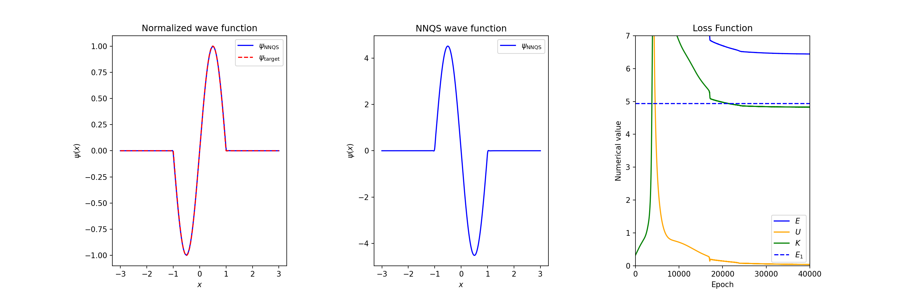

# Infinite_well
This notebook implements a program that uses the NNQS method to search for the ground and first excited states in an infinitely deep potential well. The program penalizes the wave function if it goes beyond the walls of the well. Good agreement with theoretical results has been obtained.

